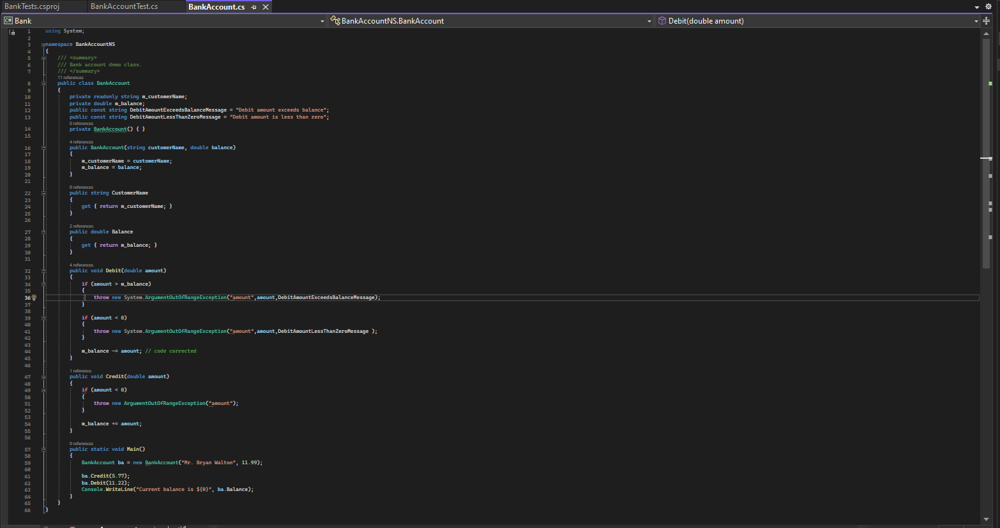
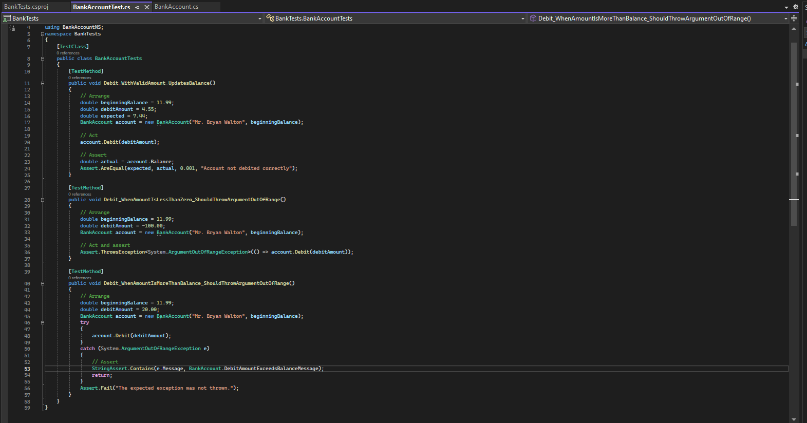
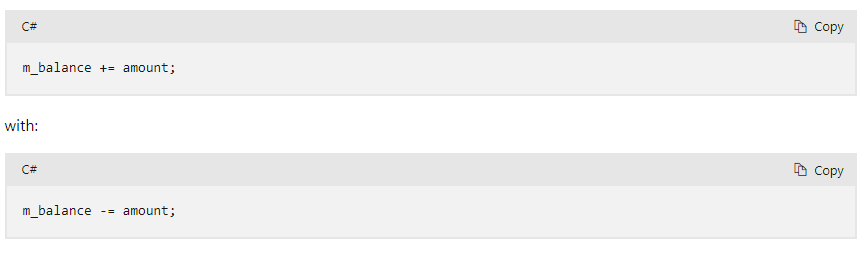
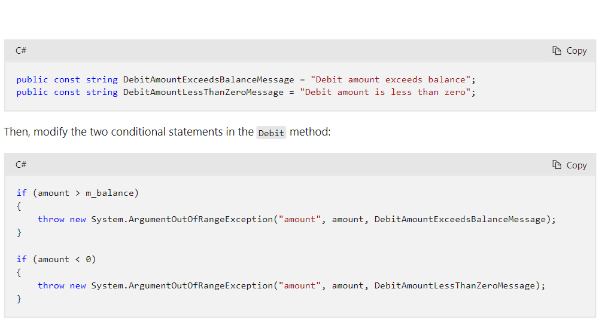
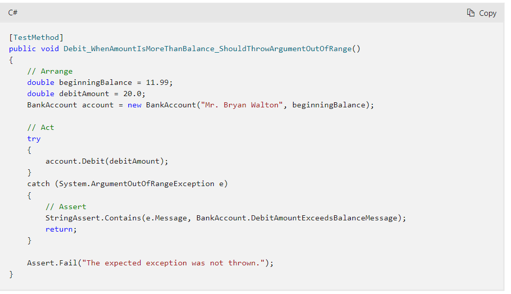
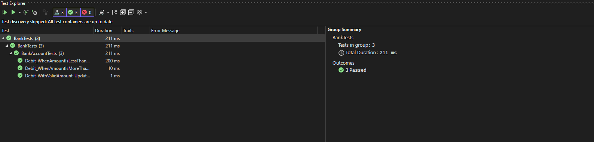

## Testes unitários utilizando Microsoft Unit Test Framework

### Projeto base para o teste - Conta Bancária

O projeto base consiste em uma classe que referencia uma conta bancária, que possui propriedades como: nome e saldo bancário, além disso possui duas funções, uma de operação de débito, e outra de operação de crédito, ambas atualizando os valores do saldo bancário, iremos testar essas funções realizando a seguir os testes unitários.

### Testes unitários 

Para o código de testes unitários, nós referenciamos o projeto base de testes, e chamamos no código usando
`using BankAccountNS`, nesse arquivo temos também uma classe que receberá os três métodos de testes desenvolvidos no tutorial, o primeiro para verificar o saldo após uma operação de débito com valor válido, a segunda para verificar quando o valor de débito for menor que 0, e a última para quando o valor de débito for maior que o saldo da conta.

### Principais partes de correção no tutorial

O tutorial abrange de forma clara o conceito de criar classes, métodos, referênciar projetos, mas também aborda temas como, correções de bugs, refatorações e analizar erros.

O primeiro erro acima se trata da correção atualização de valor da variável m_balance na função de débito, anteriormente ela estava aumentando o valor do saldo depois de um débito na conta, quando na verdade o correto seria diminuir o saldo após a efetuação da operação de débito.

Nesse outro caso temos a adição de duas strings de mensagens de erros para os testes, antes os dois testes possuiam a mesma mensagem de erro, o que dificultaria a identificação do erro, com isso os casos de testes ficam claros e bem definidos para o usuário que estiver utilizando a suite de testes.

Por fim, como última correção é adicionado `assert.fail` para lidar com casos que não retornem exceptions e no também é adiciona um `return` no bloco de catch para que o método não continue executando o restante do código.

### Resultados dos testes finais

Após seguir o tutorial chegamos na execução dos testes e podemos observar que todas os três métodos de testes passaram com sucesso.

### Conclusão

O tutorial apresenta a importância do desenvolvimento com integração de testes, visando assegurar confiabilidade e força do código, além de auxiliar na identificação de erros na fase inicial do desenvolvimento. O aprendizado desse tutorial irá auxiliar bastante tanto no desenvolvimento do TDD quanto no projeto como um todo, afinal o conceito exposto no artigo é justamente o ponto focal do problema a ser resolvido com o parceiro, implementar testes que auxiliem a indetificação precoce de problemas, com a finalidade de agilizar e automatizar a produção desses testes.
 